# MCP Tool Execution with Elicitation - Mermaid Diagrams

## 1. System Architecture Overview

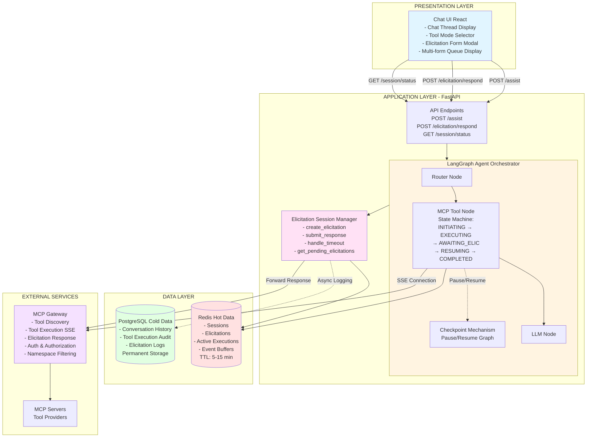

---

## 2. Component Responsibility Diagram

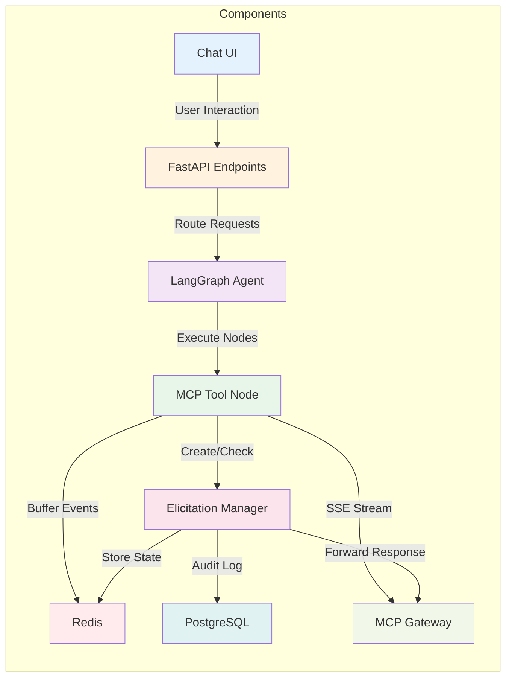

---

## 3. Data Storage Strategy Decision Tree

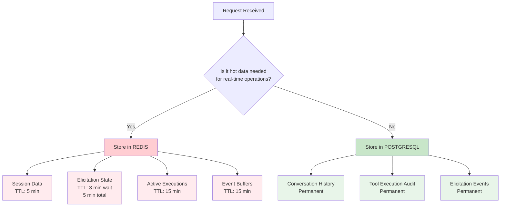

---

## 4. Flow 1: Tool Execution WITHOUT Elicitation

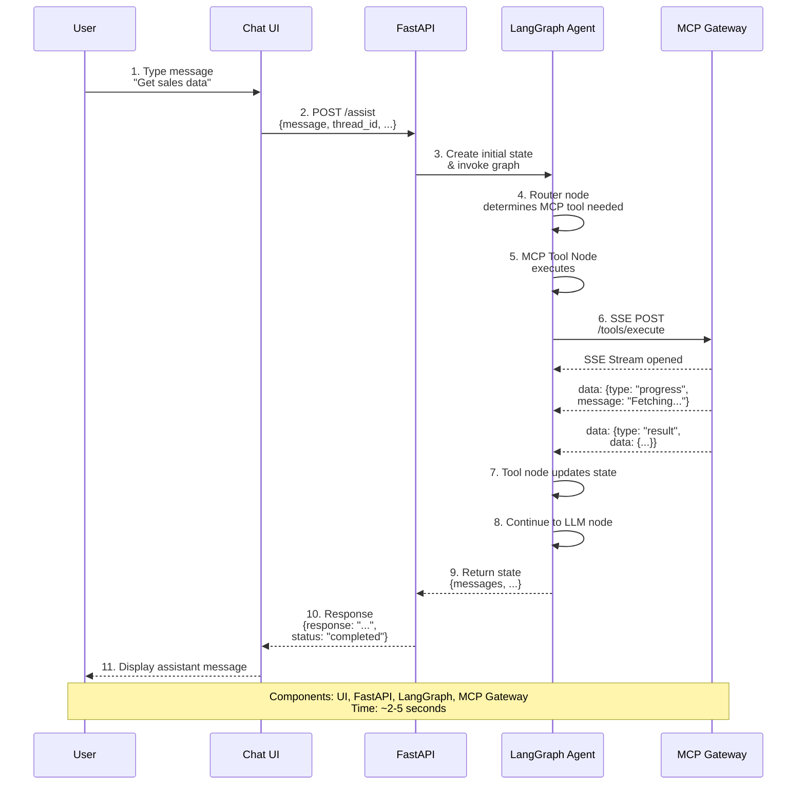

---

## 5. Flow 2: Tool Execution WITH Single Form Elicitation

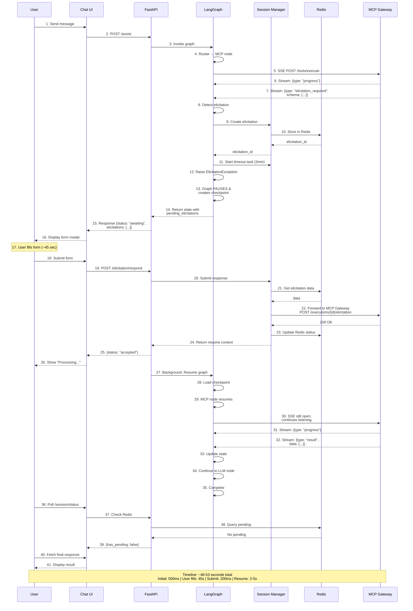

---

## 6. Flow 3: Multiple Sequential Elicitations

```mermaid
graph TD
    Start[User sends message] --> Phase1[Phase 1: Initial Execution]
    
    Phase1 --> Exec1[Agent executes tool]
    Exec1 --> Elic1{MCP Gateway sends<br/>elicitation_required<br/>Form 1}
    Elic1 --> Pause1[Graph pauses,<br/>returns Form 1 to UI]
    Pause1 --> User1[User fills Form 1]
    
    User1 --> Phase2[Phase 2: First Resume]
    Phase2 --> Submit1[User submits Form 1]
    Submit1 --> Forward1[Response forwarded<br/>to MCP Gateway]
    Forward1 --> Resume1[Graph resumes execution]
    Resume1 --> Elic2{MCP Gateway sends<br/>elicitation_required<br/>Form 2}
    Elic2 --> Pause2[Graph pauses AGAIN,<br/>returns Form 2 to UI]
    Pause2 --> User2[User fills Form 2]
    
    User2 --> Phase3[Phase 3: Final Resume]
    Phase3 --> Submit2[User submits Form 2]
    Submit2 --> Forward2[Response forwarded<br/>to MCP Gateway]
    Forward2 --> Resume2[Graph resumes execution]
    Resume2 --> Result{MCP Gateway sends<br/>result}
    Result --> Complete[Graph completes]
    Complete --> End[Final response to user]
    
    style Phase1 fill:#e3f2fd
    style Phase2 fill:#fff3e0
    style Phase3 fill:#f3e5f5
    style Pause1 fill:#ffcdd2
    style Pause2 fill:#ffcdd2
    style Complete fill:#c8e6c9
```

---

## 7. Flow 4: Timeout Scenario

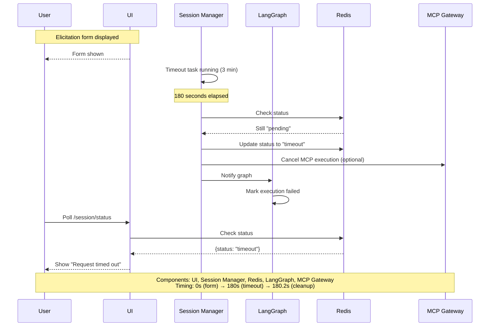

---

## 8. MCP Tool Node State Machine

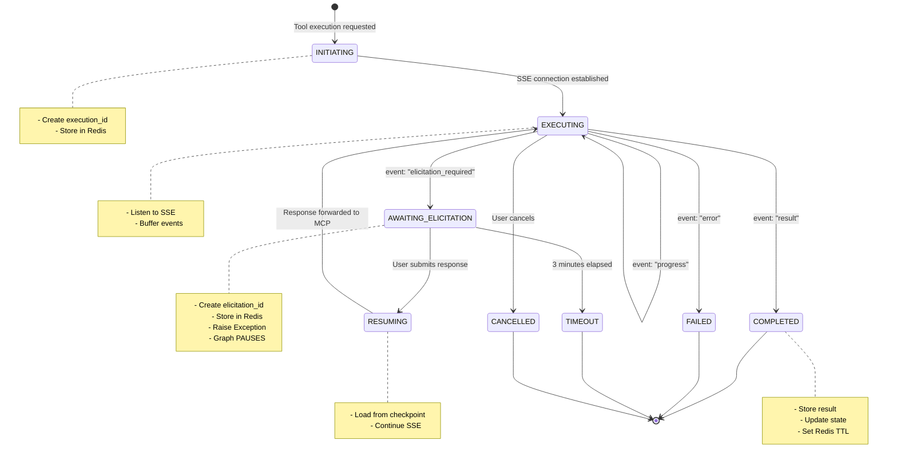

---

## 9. Elicitation Lifecycle State Machine

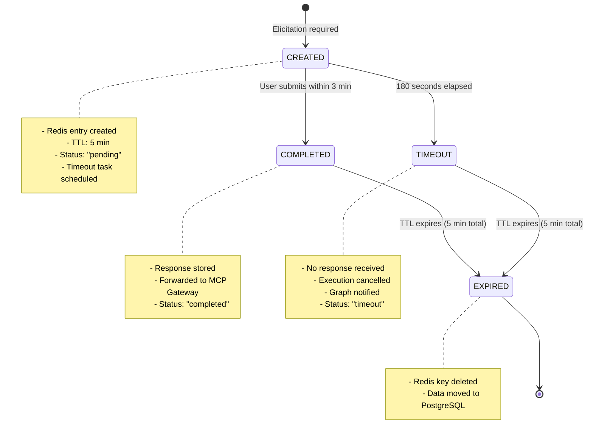

---

## 10. Redis Data Model

```mermaid
graph TB
    subgraph Redis["Redis Key Structure"]
        E1[elicitation:{uuid}<br/>Type: Hash<br/>TTL: 300s]
        E2[elicitation:callback:{uuid}<br/>Type: Hash<br/>TTL: 300s]
        T1[thread:{thread_id}:elicitations<br/>Type: Set<br/>TTL: 300s]
        X1[execution:{execution_id}<br/>Type: Hash<br/>TTL: 900s]
        T2[thread:{thread_id}:executions<br/>Type: Set<br/>TTL: 900s]
    end
    
    subgraph ElicitationData["Elicitation Fields"]
        F1[thread_id]
        F2[checkpoint_id]
        F3[execution_id]
        F4[tool_name]
        F5[status]
        F6[elicitation_type]
        F7[schema JSON]
        F8[user_response JSON]
        F9[created_at]
        F10[expires_at]
        F11[mcp_gateway_token]
    end
    
    subgraph CallbackData["Callback Fields"]
        C1[thread_id]
        C2[checkpoint_id]
        C3[execution_id]
    end
    
    subgraph ExecutionData["Execution Fields"]
        D1[thread_id]
        D2[tool_name]
        D3[status]
        D4[started_at]
        D5[mcp_sse_events JSON]
        D6[current_elicitation_id]
    end
    
    E1 -.-> ElicitationData
    E2 -.-> CallbackData
    X1 -.-> ExecutionData
    
    style E1 fill:#ffcdd2
    style E2 fill:#ffcdd2
    style T1 fill:#f8bbd0
    style X1 fill:#e1bee7
    style T2 fill:#e1bee7
```

---

## 11. Component Interaction Matrix

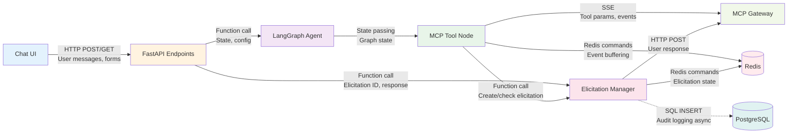

---

## 12. Deployment Architecture

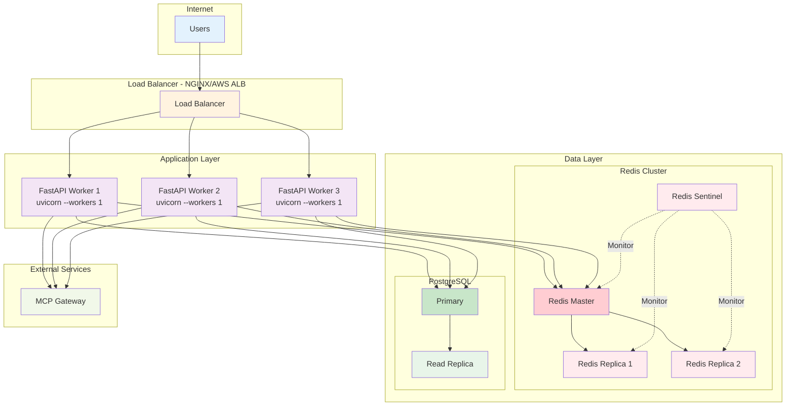

---

## 13. Scaling Strategy

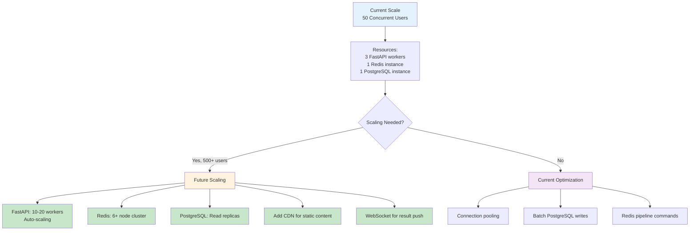

---

## 14. Monitoring & Observability

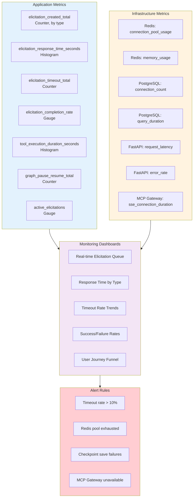

---

## 15. Error Handling Flow

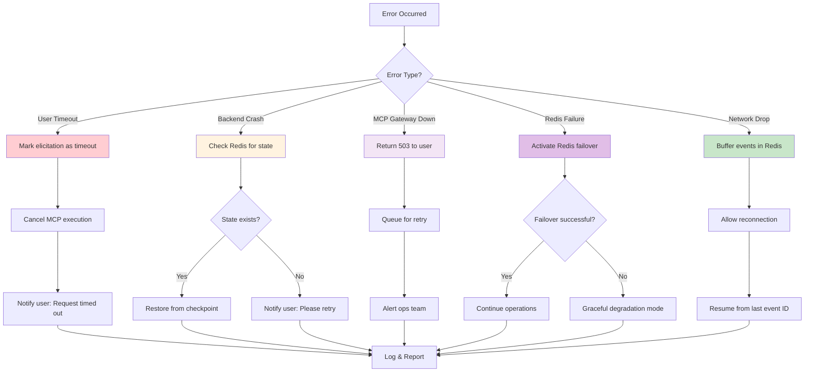

---

## 16. Query Patterns on Redis

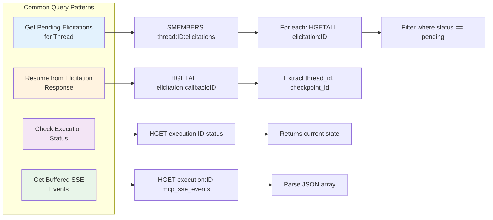

---

## 17. Critical Path Timeline

```mermaid
gantt
    title Tool Execution with Elicitation - Timeline
    dateFormat X
    axisFormat %S
    
    section Initial Request
    User sends message           :0, 1
    API processing               :1, 2
    LangGraph starts             :2, 3
    MCP connection               :3, 4
    
    section Tool Execution
    Tool executing               :4, 10
    Progress events              :4, 10
    Elicitation required event   :10, 11
    
    section Pause & Display
    Create elicitation           :11, 12
    Graph pauses                 :12, 13
    Return to UI                 :13, 14
    Display form                 :14, 15
    
    section User Action
    User fills form              :15, 60
    
    section Resume
    Submit response              :60, 61
    Forward to MCP Gateway       :61, 62
    Background resume            :62, 63
    
    section Completion
    Tool continues               :63, 68
    Final result                 :68, 69
    Display to user              :69, 70
```

---

## 18. Decision Matrix

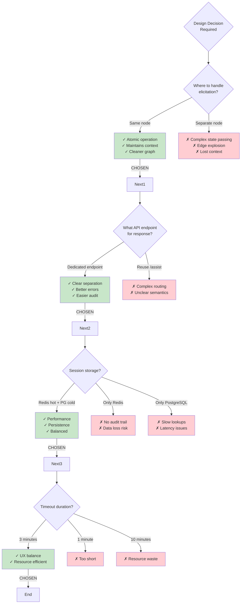

---

## How to Use These Diagrams

1. **Copy any diagram** - Each is standalone Mermaid syntax
2. **Paste into**:
   - GitHub/GitLab Markdown (renders automatically)
   - Mermaid Live Editor (https://mermaid.live)
   - Confluence (with Mermaid plugin)
   - Notion (with Mermaid support)
   - VS Code (with Mermaid extension)

3. **Customize easily** - All text is editable
4. **Export** - From Mermaid Live Editor to PNG/SVG/PDF

---

## Diagram Quick Reference

| Diagram | Purpose | Key Audience |
|---------|---------|--------------|
| 1. System Architecture | Overall system view | Lead, Architect |
| 2. Component Responsibility | Who does what | Team, New developers |
| 3. Data Storage Strategy | Redis vs PostgreSQL decisions | Architect, DBA |
| 4-7. Flows | Step-by-step execution paths | All stakeholders |
| 8-9. State Machines | Internal state transitions | Developers |
| 10. Redis Data Model | Key structure & queries | Backend developers |
| 11. Interaction Matrix | Component communication | Integration team |
| 12. Deployment | Production setup | DevOps, SRE |
| 13. Scaling | Growth strategy | Architect, Leadership |
| 14. Monitoring | Observability setup | DevOps, SRE |
| 15. Error Handling | Failure scenarios | Developers, QA |
| 16. Query Patterns | Redis access patterns | Backend developers |
| 17. Timeline | Performance expectations | Product, QA |
| 18. Decision Matrix | Design rationale | Lead, Architect |
